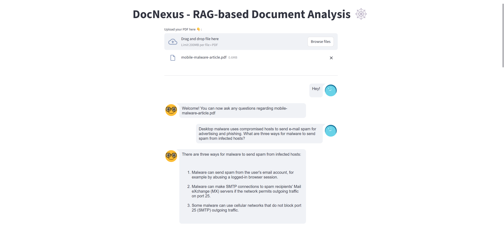
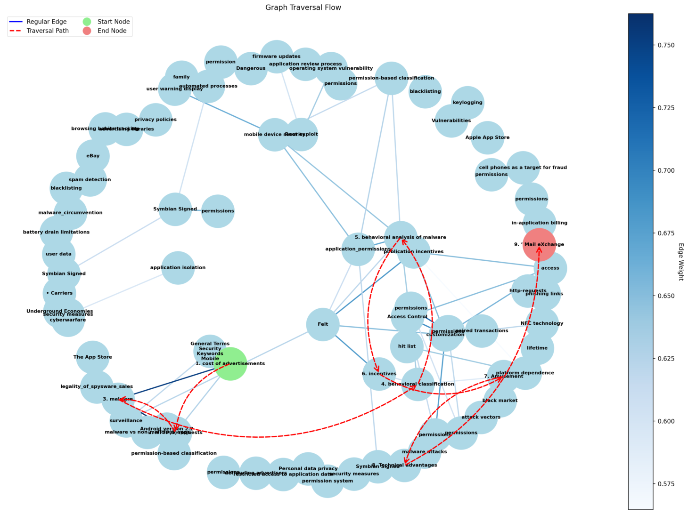

# DocNexus 🕸️

## Purpose

DocNexus is a local-first, privacy focused **RAG (Retrieval-Augmented Generation)** system designed for deep analysis of PDF documents. It combines document parsing, knowledge graph construction, and large language model inference to enable context aware question answering for an uploaded document.

The project emphasizes:
- Local inference (no cloud APIs)
- Graph-based reasoning instead of pure vector similarity
- Transparency into how answers are derived


## Key Features

- **PDF RAG workflow**
  - Upload PDF for focused analysis
- **Graph-based retrieval**
  - Documents are converted into a knowledge graph of concepts and relationships
- **LLM-powered reasoning**
  - Uses Ollama-hosted models (e.g., `llama3.2`) via LangChain
- **Interactive Streamlit UI**
  - Chat-style interface for querying the document
- **Graph traversal visualization**
  - Visual insight into how the system navigates the knowledge graph
- **Local & private**
  - No external API calls; all processing runs on your machine

## UI



The Streamlit UI allows users to upload a PDF and interactively query it using a chat style interface.


## Knowledge Graph



This visualization shows how DocNexus traverses the knowledge graph to assemble context for answering a query.


## Architecture Overview

**High-level flow:**

1. **PDF Upload (Streamlit)**
   - User uploads a PDF through the UI

2. **Document Loading & Chunking**
   - `PyPDFLoader` extracts text
   - Text is chunked for processing

3. **Knowledge Graph Construction**
   - Concepts and entities are extracted using an LLM
   - Nodes represent concepts
   - Edges represent semantic relationships with weights

4. **Graph RAG Querying**
   - User query triggers graph traversal
   - Relevant nodes are prioritized and explored
   - Context is assembled from traversal results

5. **LLM Answer Generation**
   - The selected context is sent to Ollama
   - Final answer is generated and returned to the UI

6. **Visualization**
   - Traversal path and graph structure are rendered using NetworkX + Matplotlib


## Requirements

### System
- Docker & Docker Compose
- Optional: NVIDIA GPU + NVIDIA Container Toolkit (for GPU inference)

### Software
- Python 3.11 (inside container)
- Ollama
- Streamlit

## Getting Started

### 1. Clone the Repository
```bash
git clone https://github.com/SeanClay10/DocNexus
cd docnexus
```

### 2. Build and Start Services
```bash
docker compose up --build
```

After the first build, you can run:
```bash
docker compose up
```

### 3. Access the App
- Streamlit UI: http://localhost:8501
- Ollama API: http://localhost:11434

### 4. Upload & Query
1. Upload a PDF
2. Ask questions in the chat interface
3. Wait for graph construction
4. Inspect traversal visualizations


---

DocNexus is intended as an experimental platform for exploring **RAG**, context aware AI workflows, and local LLM deployment.
